# EECS 731 - Project 6
### Author: Jace Kline

## Project Overview
For the chosen dataset, build one or more anomaly detection models to predict when a new entry in a series of data is an anomaly. We will utilize a dataset that consists of the Twitter volume of tweets containing the Facebook ticker symbol.

## Loading the Data


```python
# General imports
import re
import numpy as np
import pandas as pd
from matplotlib import pyplot as plt
%matplotlib inline
```


```python
df = pd.read_csv('../data/twitter_FB.csv')
df.head()
```


<div>
<table border="1" class="dataframe">
  <thead>
    <tr style="text-align: right;">
      <th></th>
      <th>timestamp</th>
      <th>value</th>
    </tr>
  </thead>
  <tbody>
    <tr>
      <th>0</th>
      <td>2015-02-26 21:42:53</td>
      <td>53</td>
    </tr>
    <tr>
      <th>1</th>
      <td>2015-02-26 21:47:53</td>
      <td>64</td>
    </tr>
    <tr>
      <th>2</th>
      <td>2015-02-26 21:52:53</td>
      <td>49</td>
    </tr>
    <tr>
      <th>3</th>
      <td>2015-02-26 21:57:53</td>
      <td>48</td>
    </tr>
    <tr>
      <th>4</th>
      <td>2015-02-26 22:02:53</td>
      <td>22</td>
    </tr>
  </tbody>
</table>
</div>


## Data Cleaning
Now that we have loaded the data from the CSV file, we need to perform some initial transformations to make it usable. These will involve transforming the 'timestamp' column and filtering out NaN values.

### Transforming the 'timestamp'
Since the 'timestamp' field has inherent sequencing and frequency properties, we must convert this column into a form that Pandas can utilize in this way. Currently, this column is in the form of strings.


```python
df['timestamp'] = pd.to_datetime(df['timestamp'])
df['timestamp'].dtype
```


    dtype('<M8[ns]')


As we can see above, our field is transformed into a particular DateTime data type utilized by Pandas.

### Ordering by Time
In addition to simply having the timestamp quantity, we want to ensure our data is sorted by the timestamp.


```python
df = df.sort_values(by='timestamp')
```

### Making the Timestamp into the Index
We want to make the 'timestamp' field into the index of our data, but we must first make sure that each timestamp is unique and can therefore act as a valid, unique index.


```python
print('Unique timestamps: {}'.format(len(np.unique(df['timestamp']))))
print('Total timestamps: {}'.format(len(df['timestamp'])))
```

    Unique timestamps: 15833
    Total timestamps: 15833


Now that we see our timestamps are indeed unique, we shall convert the index.


```python
df.index = pd.DatetimeIndex(df['timestamp'])
```

### Removing NaN / Null Values
Now that we have transformed the 'timestamp' field, we shall remove any null values.


```python
df = df.dropna()
```

### Defining an Equivalent Series
Since our dataset at the moment is in the form of a DataFrame object despite the fact there is only an index and value column, we should convert it to an equivalent Series object.


```python
ser = df['value']
ser.head()
```


    timestamp
    2015-02-26 21:42:53    53
    2015-02-26 21:47:53    64
    2015-02-26 21:52:53    49
    2015-02-26 21:57:53    48
    2015-02-26 22:02:53    22
    Name: value, dtype: int64


## Data Exploration
Now that we have cleaned the data, we shall explore the data to find feature engineering opportunities.

### Basic Statistics and Visualization


```python
df.describe()
```


<div>
<table border="1" class="dataframe">
  <thead>
    <tr style="text-align: right;">
      <th></th>
      <th>value</th>
    </tr>
  </thead>
  <tbody>
    <tr>
      <th>count</th>
      <td>15833.000000</td>
    </tr>
    <tr>
      <th>mean</th>
      <td>17.811280</td>
    </tr>
    <tr>
      <th>std</th>
      <td>19.740055</td>
    </tr>
    <tr>
      <th>min</th>
      <td>0.000000</td>
    </tr>
    <tr>
      <th>25%</th>
      <td>9.000000</td>
    </tr>
    <tr>
      <th>50%</th>
      <td>14.000000</td>
    </tr>
    <tr>
      <th>75%</th>
      <td>22.000000</td>
    </tr>
    <tr>
      <th>max</th>
      <td>1258.000000</td>
    </tr>
  </tbody>
</table>
</div>


```python
df['value'].plot()
```


    <matplotlib.axes._subplots.AxesSubplot at 0x7f3e27fdcf70>


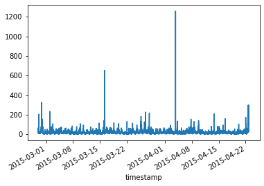


### Calculating Time Range
By calculating the time range of the timestamps and considering the granularity of the data, we can make decisions on how to partition, group, and visualize our data.


```python
start = df['timestamp'].min()
end = df['timestamp'].max()
    
print('Start: {}\nEnd: {}\nRange: {}'.format(start, end, end-start))
```

    Start: 2015-02-26 21:42:53
    End: 2015-04-22 21:02:53
    Range: 54 days 23:20:00


### Visualizations by Hour and Day
Let's show the value of the mean and max of values when broken down by hour and day, respectively.

#### By Hour


```python
hourly_means = ser.resample('H').mean()
hourly_maxes = ser.resample('H').max()
```


```python
def plot_series(ser, title):
    ser.plot(title=title)
    plt.show()
```


```python
plot_series(hourly_means, 'Hourly Mean Values')
plot_series(hourly_maxes, 'Hourly Maximum Values')
```


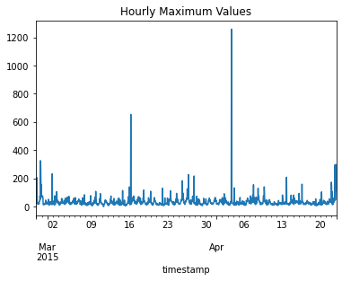


#### By Day


```python
daily_means = ser.resample('D').mean()
daily_maxes = ser.resample('D').max()
```


```python
plot_series(daily_means, 'Daily Mean Values')
plot_series(daily_maxes, 'Daily Maximum Values')
```


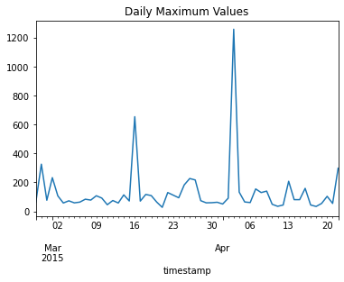


### Value Distributions
Now that we have a general feel for the data, we shall observe frequency distributions of the data when we group by different time measures. 


```python
ser.hist(bins=500)
plt.title('Value Histogram (Original Data)')
plt.show()
```


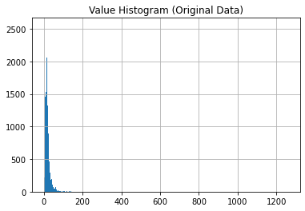


```python
hourly_means.hist(bins=500)
plt.title('Value Histogram (Hourly Mean)')
plt.show()
```


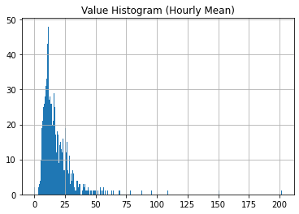


```python
daily_means.hist(bins=20)
plt.title('Value Histogram (Daily Mean)')
plt.show()
```


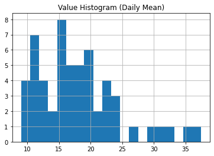


## Feature Engineering
Now that we have explored our data, we shall engineer features that help our model pick out anomalies by introducing information that compares each value to average values of its time properties. These will include:
1. hour_ratio = value / (avg. value of that hour)
2. day_ratio = value / (avg. value of that day)
3. hod_ratio = value / (avg. value of that hour of the day)
4. dow_ratio = value / (avg. value of that day of the week)
5. change = (value - prev_value) / prev_value


```python
tdeltas = df.timestamp - df.timestamp[0]
```


```python
df['date'] = df.timestamp.apply(lambda x: x.date())
df.head()
```


<div>
<table border="1" class="dataframe">
  <thead>
    <tr style="text-align: right;">
      <th></th>
      <th>timestamp</th>
      <th>value</th>
      <th>date</th>
    </tr>
    <tr>
      <th>timestamp</th>
      <th></th>
      <th></th>
      <th></th>
    </tr>
  </thead>
  <tbody>
    <tr>
      <th>2015-02-26 21:42:53</th>
      <td>2015-02-26 21:42:53</td>
      <td>53</td>
      <td>2015-02-26</td>
    </tr>
    <tr>
      <th>2015-02-26 21:47:53</th>
      <td>2015-02-26 21:47:53</td>
      <td>64</td>
      <td>2015-02-26</td>
    </tr>
    <tr>
      <th>2015-02-26 21:52:53</th>
      <td>2015-02-26 21:52:53</td>
      <td>49</td>
      <td>2015-02-26</td>
    </tr>
    <tr>
      <th>2015-02-26 21:57:53</th>
      <td>2015-02-26 21:57:53</td>
      <td>48</td>
      <td>2015-02-26</td>
    </tr>
    <tr>
      <th>2015-02-26 22:02:53</th>
      <td>2015-02-26 22:02:53</td>
      <td>22</td>
      <td>2015-02-26</td>
    </tr>
  </tbody>
</table>
</div>


```python
df['hod'] = df.timestamp.dt.hour
```

### Computing 'hour_ratio' feature
This feature will measure a particular value versus the average of all values within that hour.


```python
hourly_avgs = df.groupby(['date', 'hod']).mean().reset_index()[['date', 'hod', 'value']].rename({'value' : 'hourly_value'}, axis=1)
df = df.merge(hourly_avgs, on=['date','hod'], how='left').set_index('timestamp')
df.head()
```


<div>
<table border="1" class="dataframe">
  <thead>
    <tr style="text-align: right;">
      <th></th>
      <th>value</th>
      <th>date</th>
      <th>hod</th>
      <th>hourly_value</th>
    </tr>
    <tr>
      <th>timestamp</th>
      <th></th>
      <th></th>
      <th></th>
      <th></th>
    </tr>
  </thead>
  <tbody>
    <tr>
      <th>2015-02-26 21:42:53</th>
      <td>53</td>
      <td>2015-02-26</td>
      <td>21</td>
      <td>53.500000</td>
    </tr>
    <tr>
      <th>2015-02-26 21:47:53</th>
      <td>64</td>
      <td>2015-02-26</td>
      <td>21</td>
      <td>53.500000</td>
    </tr>
    <tr>
      <th>2015-02-26 21:52:53</th>
      <td>49</td>
      <td>2015-02-26</td>
      <td>21</td>
      <td>53.500000</td>
    </tr>
    <tr>
      <th>2015-02-26 21:57:53</th>
      <td>48</td>
      <td>2015-02-26</td>
      <td>21</td>
      <td>53.500000</td>
    </tr>
    <tr>
      <th>2015-02-26 22:02:53</th>
      <td>22</td>
      <td>2015-02-26</td>
      <td>22</td>
      <td>31.833333</td>
    </tr>
  </tbody>
</table>
</div>


```python
def hour_ratio(r):
    return r.value / r.hourly_value if r.hourly_value >= 1 else 1.0

df['hour_ratio'] = df.apply(hour_ratio, axis=1)
df.hour_ratio.head()
```


    timestamp
    2015-02-26 21:42:53    0.990654
    2015-02-26 21:47:53    1.196262
    2015-02-26 21:52:53    0.915888
    2015-02-26 21:57:53    0.897196
    2015-02-26 22:02:53    0.691099
    Name: hour_ratio, dtype: float64


```python
df.hour_ratio.plot(title='Ratio Between Value and Hourly Average')
plt.show()
```


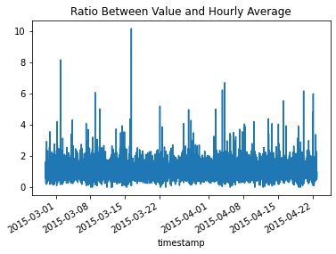


### Computing 'day_ratio' feature
This feature will measure a specific value over the average value for that entire day.


```python
daily_avgs = df.groupby('date').mean().value
```


```python
df['day_ratio'] = df.apply(lambda r: r.value / daily_avgs[r.date], axis=1)
df.day_ratio.head()
```


    timestamp
    2015-02-26 21:42:53    1.606061
    2015-02-26 21:47:53    1.939394
    2015-02-26 21:52:53    1.484848
    2015-02-26 21:57:53    1.454545
    2015-02-26 22:02:53    0.666667
    Name: day_ratio, dtype: float64


```python
df.day_ratio.plot(title='Ratio Between Value and Daily Average')
plt.show()
```


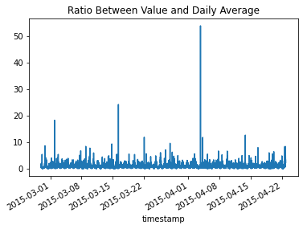


### Finding Average Value by Hour of Day

#### Grouping by Hour of Day and taking the average


```python
hod_means = df.groupby('hod').mean().value
plt.bar(hod_means.index, hod_means)
plt.title('Average Value by Hour of Day')
plt.show()
```


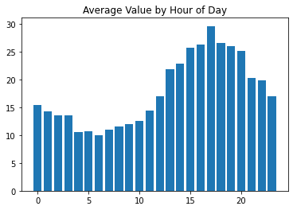


#### Creating the 'hod_ratio' feature


```python
df['hod_ratio'] = df.apply(lambda r: r.value / hod_means[r.hod], axis=1)
df.hod_ratio.head()
```


    timestamp
    2015-02-26 21:42:53    2.618323
    2015-02-26 21:47:53    3.161749
    2015-02-26 21:52:53    2.420714
    2015-02-26 21:57:53    2.371312
    2015-02-26 22:02:53    1.105949
    Name: hod_ratio, dtype: float64


### Finding Average Value by Day of Week
By observing the *Daily Mean Values* graph, we can see that the average values fluctuate rather cyclically week after week. We shall find the average value by day of the week. Our first day is 02/26/2015 which was a Thursday. We will encode the day of the week as 0=Monday, 1=Tuesday, ..., 6=Sunday.

#### Mapping each value to day of week


```python
daydeltas = tdeltas.dt.days
daysofweek = (daydeltas + 3).mod(7)
daysofweek
```


    timestamp
    2015-02-26 21:42:53    3
    2015-02-26 21:47:53    3
    2015-02-26 21:52:53    3
    2015-02-26 21:57:53    3
    2015-02-26 22:02:53    3
                          ..
    2015-04-22 20:42:53    1
    2015-04-22 20:47:53    1
    2015-04-22 20:52:53    1
    2015-04-22 20:57:53    1
    2015-04-22 21:02:53    1
    Name: timestamp, Length: 15833, dtype: int64


```python
df['dow'] = daysofweek
```

#### Grouping by day of week and taking the average
Now that we have mapped each value to its corresponding day of week identifier (0-6), we shall group by the day of week and find the average of values for each of the day of week groups.


```python
dow_means = df.groupby('dow').mean()
dow_means['dayname'] = ['Mon', 'Tues', 'Wed', 'Thurs', 'Fri', 'Sat', 'Sun']
dow_means
```


<div>
<table border="1" class="dataframe">
  <thead>
    <tr style="text-align: right;">
      <th></th>
      <th>value</th>
      <th>hod</th>
      <th>hourly_value</th>
      <th>hour_ratio</th>
      <th>day_ratio</th>
      <th>hod_ratio</th>
      <th>dayname</th>
    </tr>
    <tr>
      <th>dow</th>
      <th></th>
      <th></th>
      <th></th>
      <th></th>
      <th></th>
      <th></th>
      <th></th>
    </tr>
  </thead>
  <tbody>
    <tr>
      <th>0</th>
      <td>18.396267</td>
      <td>11.500000</td>
      <td>18.453125</td>
      <td>0.997826</td>
      <td>0.985849</td>
      <td>1.027371</td>
      <td>Mon</td>
    </tr>
    <tr>
      <th>1</th>
      <td>22.420549</td>
      <td>11.471049</td>
      <td>22.350022</td>
      <td>1.002572</td>
      <td>1.015612</td>
      <td>1.226850</td>
      <td>Tues</td>
    </tr>
    <tr>
      <th>2</th>
      <td>20.154266</td>
      <td>11.500000</td>
      <td>20.191964</td>
      <td>0.998259</td>
      <td>0.989574</td>
      <td>1.122539</td>
      <td>Wed</td>
    </tr>
    <tr>
      <th>3</th>
      <td>20.648872</td>
      <td>11.500000</td>
      <td>20.720631</td>
      <td>0.999297</td>
      <td>0.998217</td>
      <td>1.125030</td>
      <td>Thurs</td>
    </tr>
    <tr>
      <th>4</th>
      <td>13.758681</td>
      <td>11.500000</td>
      <td>13.706308</td>
      <td>0.999565</td>
      <td>1.009807</td>
      <td>0.828238</td>
      <td>Fri</td>
    </tr>
    <tr>
      <th>5</th>
      <td>10.860243</td>
      <td>11.500000</td>
      <td>10.845341</td>
      <td>1.000596</td>
      <td>0.964110</td>
      <td>0.632849</td>
      <td>Sat</td>
    </tr>
    <tr>
      <th>6</th>
      <td>18.746962</td>
      <td>11.500000</td>
      <td>18.722946</td>
      <td>1.001675</td>
      <td>1.035575</td>
      <td>1.053130</td>
      <td>Sun</td>
    </tr>
  </tbody>
</table>
</div>


```python
plt.bar(dow_means.dayname, dow_means.value)
plt.title('Average value by day of week')
plt.show()
```


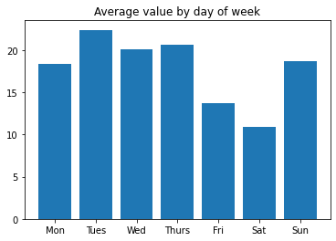


#### Creating the 'dow_ratio' feature


```python
df['dow_ratio'] = df.apply(lambda r: r.value / dow_means.iloc[r.dow].value, axis=1)
df.dow_ratio.head()
```


    timestamp
    2015-02-26 21:42:53    2.566726
    2015-02-26 21:47:53    3.099443
    2015-02-26 21:52:53    2.373011
    2015-02-26 21:57:53    2.324582
    2015-02-26 22:02:53    1.065434
    Name: dow_ratio, dtype: float64


### Computing the 'change' feature
This feature will measure the percentage change between the last row's value and the current row's value.


```python
prevs = df.value.shift()
df['prev'] = prevs
```


```python
def change(r):
    return ((r.value - r.prev) / r.prev) if r.prev == r.prev and r.prev > 1 else 0.0
```


```python
df['change'] = df.apply(change, axis=1)
df['change'].head()
```


    timestamp
    2015-02-26 21:42:53    0.000000
    2015-02-26 21:47:53    0.207547
    2015-02-26 21:52:53   -0.234375
    2015-02-26 21:57:53   -0.020408
    2015-02-26 22:02:53   -0.541667
    Name: change, dtype: float64


```python
df.change.plot(title='Value Change Percentages')
plt.show()
```


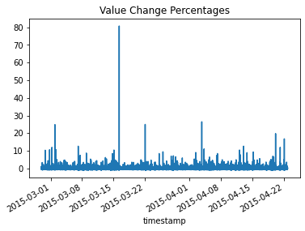


## Feature Cleanup
Now that we have engineered features that attempt to put perspective and context to each data point, we shall remove extraneous features from our dataset. We shall also save our dataset to back it up.

### Removing Extraneous Features


```python
df = df.drop(['date', 'hod', 'hourly_value', 'dow', 'prev'], axis=1)
df.head()
```


<div>
<table border="1" class="dataframe">
  <thead>
    <tr style="text-align: right;">
      <th></th>
      <th>value</th>
      <th>hour_ratio</th>
      <th>day_ratio</th>
      <th>hod_ratio</th>
      <th>dow_ratio</th>
      <th>change</th>
    </tr>
    <tr>
      <th>timestamp</th>
      <th></th>
      <th></th>
      <th></th>
      <th></th>
      <th></th>
      <th></th>
    </tr>
  </thead>
  <tbody>
    <tr>
      <th>2015-02-26 21:42:53</th>
      <td>53</td>
      <td>0.990654</td>
      <td>1.606061</td>
      <td>2.618323</td>
      <td>2.566726</td>
      <td>0.000000</td>
    </tr>
    <tr>
      <th>2015-02-26 21:47:53</th>
      <td>64</td>
      <td>1.196262</td>
      <td>1.939394</td>
      <td>3.161749</td>
      <td>3.099443</td>
      <td>0.207547</td>
    </tr>
    <tr>
      <th>2015-02-26 21:52:53</th>
      <td>49</td>
      <td>0.915888</td>
      <td>1.484848</td>
      <td>2.420714</td>
      <td>2.373011</td>
      <td>-0.234375</td>
    </tr>
    <tr>
      <th>2015-02-26 21:57:53</th>
      <td>48</td>
      <td>0.897196</td>
      <td>1.454545</td>
      <td>2.371312</td>
      <td>2.324582</td>
      <td>-0.020408</td>
    </tr>
    <tr>
      <th>2015-02-26 22:02:53</th>
      <td>22</td>
      <td>0.691099</td>
      <td>0.666667</td>
      <td>1.105949</td>
      <td>1.065434</td>
      <td>-0.541667</td>
    </tr>
  </tbody>
</table>
</div>


### Saving the Engineered Dataset


```python
df.to_csv('../data/engineered.csv')
```

## Model Selection
We have our final feature-engineered dataset. We can fit and predict our models on datasets to determine how many outliers we capture. We will use the Local Outlier Factor and One-Class SVM models from SciKit Learn.

### Model Imports


```python
from sklearn.neighbors import LocalOutlierFactor
from sklearn.svm import OneClassSVM
from sklearn.covariance import EllipticEnvelope
```


```python
def outlier_values(model):
    res = pd.Series(model.fit_predict(df), index=df.index)
    df_ = pd.concat([df.value, res], axis=1)
    df_.columns = ['value', 'outlier']
    df_.index = df.index
    return df_
```


```python
def show_outliers(model, model_name):
    df_ = outlier_values(model)
    outliers = df_[df_.outlier == -1]
    l = len(outliers)
    p = (l / len(df_)) * 100
    print('Model: {}\nNumber of outliers: {}\nOutlier Percentage: {:.2f}%'.format(model_name, l, p))
```

### Local Outlier Factor
The first model we shall evaluate is the Local Outlier Factor model. 


```python
model = LocalOutlierFactor()
show_outliers(model, 'Local Outlier Factor')
```

    Model: Local Outlier Factor
    Number of outliers: 605
    Outlier Percentage: 3.82%


As we can see above, the Local Outlier Factor algorithm produces 0.58% outlier rate.

### One Class SVM
Next, we shall test a support vector machine (One Class SVM) model. After experimentation with the 'nu' hyperparameter, we use the following...


```python
model = OneClassSVM(kernel='rbf', nu=0.005)
show_outliers(model, 'One Class SVM')
```

    Model: One Class SVM
    Number of outliers: 81
    Outlier Percentage: 0.51%


This model produces a higher outlier rate than the Local Outlier Factor model.

### Elliptic Envelope Model
Lastly we shall test the Elliptic Envelope model. With this model, we can specify the contamination hyperparameter.


```python
model = EllipticEnvelope(contamination=0.01)
show_outliers(model, 'Elliptic Envelope')
```

    Model: Elliptic Envelope
    Number of outliers: 159
    Outlier Percentage: 1.00%


## Conclusion
The purpose of this project was to build anomaly detection models for a chosen dataset. We used a dataset that tracked the Tweet quantity about the Facebook (FB) ticker symbol over time. We used our original feature to generate 5 additional features. These features were designed to give each data point value "context" with respect to the other data points' values and value averages. After extensive feature engineering, we chose to test 3 models on our engineered dataset. Since anomaly detection is naturally unsupervised, we simply had to compare the outlier/anomaly percentage for each of the models used. We had to tweak parameters to reach reasonable percentages with the models. Given more time, we would explore the use of a GAT (Generative Adversarial Network).


```python

```
